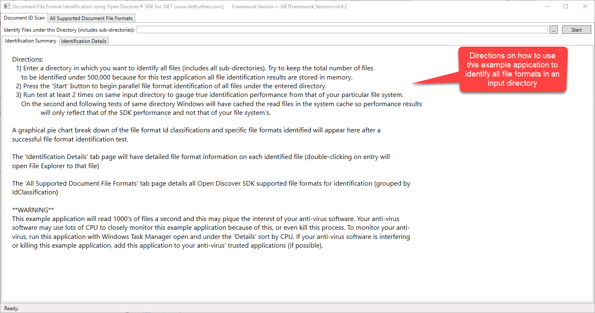
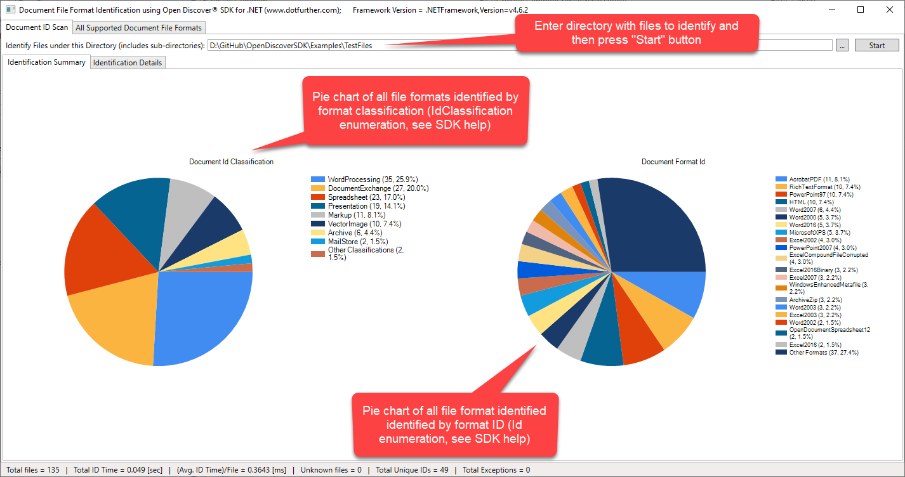
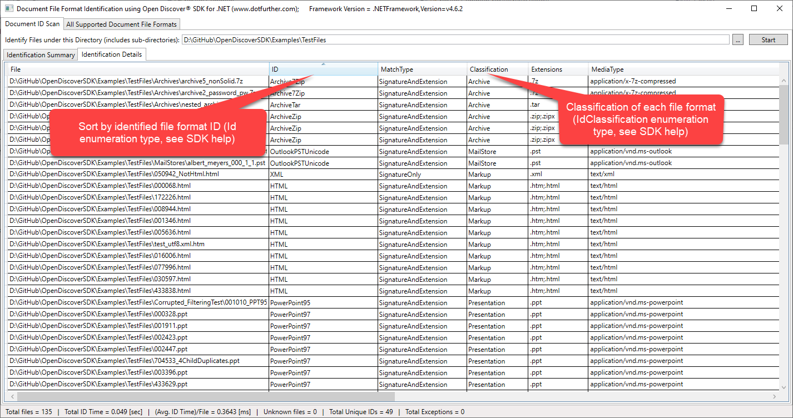
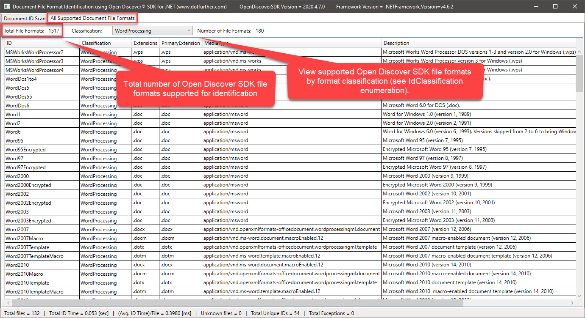

Copyright © 2019-2021 dotFurther Inc. All rights reserved.

## File Format Document Identification Example

### DocumentIdentifierExample.csproj:
This example shows how to use the Open Discover SDK DocumentIdentifier API in a parallel ForEach loop to identify the file formats 
of files contained in a input directory (including all files in all sub-directories).

The overloaded OpenDiscoverSDK.DocumentIdentifier.Identify methods take either a System.IO.Stream or byte array of file bytes as an argument along with an optional (but highly recommended) file name/file path argument. When opening a stream or reading in all file bytes, it is up to the user to take care of long file paths that are greater than MAX_PATH characters in length (see note at end of this readme).

Any higher-level document processing application built upon Open Discover SDK should make use of file identification at the start of a workflow in order to make decisions on how to best process the document set.

### How to use this example:

Upon DocumentIdentifierExample.exe app startup, the "Directions" screen is shown. Follow these directions: 

Screen shot of "Identification Summary" view (visual summary of file format classifications and format IDs):

Screen shot of "Identification Details" view (details of each file format identified):

Screen shot of "All Supported File Formats" view (at this time, Open Discover SDK supports 1,517 file formats for identification). This view allows viewing of all Open Discover SDK supported file formats for identification by file format classification (IdClassification.Email, IdClassification.WordProcessing, IdClassification.Spreadsheet, etc):

To ENABLE long file path support for Windows 10 and .NET 5, see this article:
 https://blogs.msdn.microsoft.com/jeremykuhne/2016/07/30/net-4-6-2-and-long-paths-on-windows-10/

------------------------------------------------------------------------------------------------------------------------
### Warning: 
Watch your anti-virus software in Windows Task Manager (under Task Manager "Details" sort by CPU). Since this example 
application will identify hundreds to thousands of files per second (opening a FileStream for each file), your anti-virus 
software may monitor it very closely and this monitoring may use a lot of the available CPU. The anti-virus program may even 
kill the process. If this happens you will need to configure your anti-virus to 'trust' this application or any document 
processing application you build with SDK.

------------------------------------------------------------------------------------------------------------------------
### Note: 
Open Discover SDK is comprised of .NET 5 x64 assemblies due to unmanaged code dependencies

- Run Microsoft Visual Studio C# examples in x64 solution platform (either Debug or Release)
- To edit WinForm forms, set build platform to "Any CPU" and rebuild. This is required to edit WinForm windows as Visual Studio WinForm designer is a 32-bit process. When done, set solution platform back to x64 before executing in either x64 Debug/Release mode.
- If you get run-time initialization exceptions with error messages like "An attempt was made to load a program with
  an incorrect format" then you are mixing x86 and x64 platforms. 

