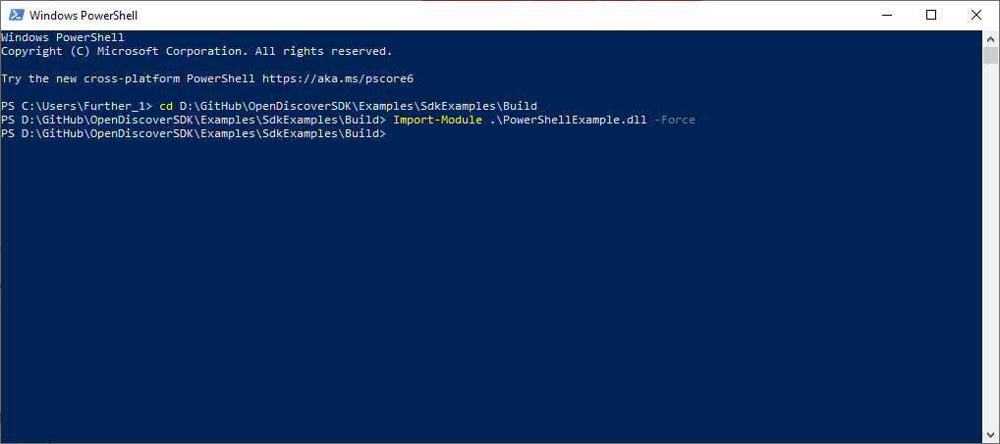
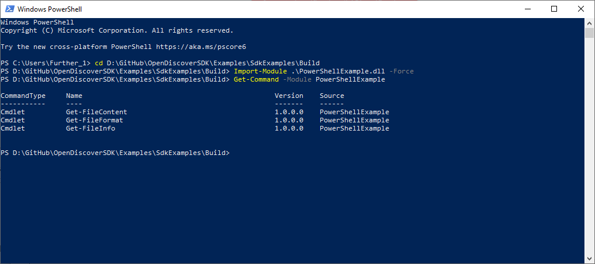
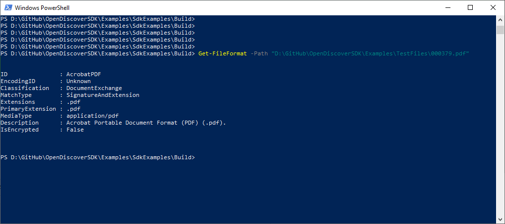
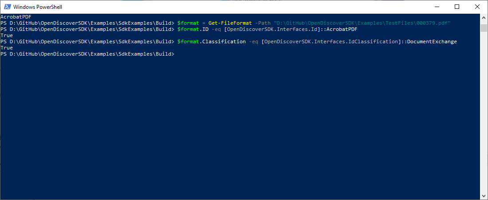
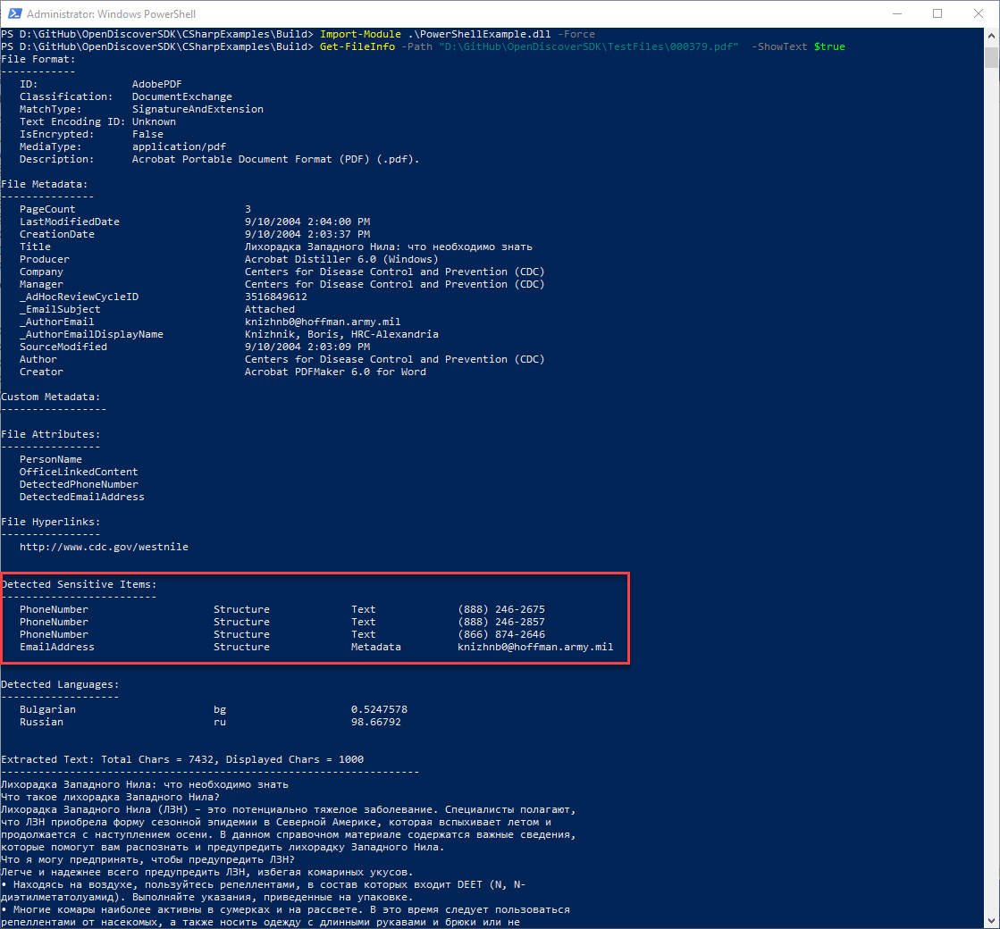
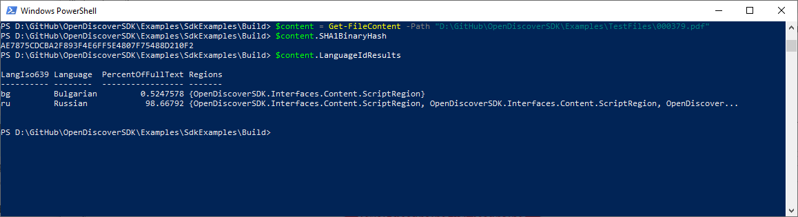
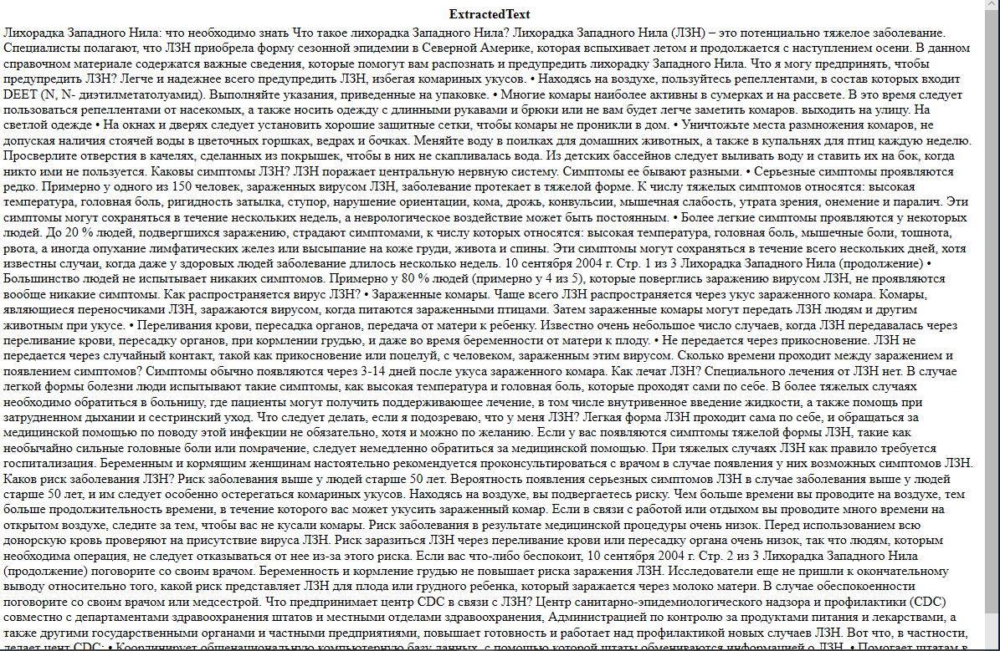

Copyright © 2019-2025 dotFurther Inc. All rights reserved.

# PowerShellExample.csproj:

The classes in this example project show how the Open Discover SDK API can be used in C# PowerShell Cmdlets. IT professionals
can easily take advantage of the power of Open Discover SDK by expanding on these examples or creating their own Cmdlets.

The Cmdlet derived classes in this example C# project show how to use the Open Discover SDK API to:
- Identify a file's format (GetFileFormatIdCmdlet.cs)
- Display a summary of a file's content (GetFileInfoCmdlet.cs)
- Extract document text, metadata, sensitive items, and return the result as a DocumentContent object (GetFileContentCmdlet.cs)

See the ExamplePowerShell.ps1 included with project.

# Note:
These examples requires PowerShell version 7.1.2 or newer for .NET 5 support. PowerShell release can be downloaded from official GitHub repository: https://github.com/PowerShell/PowerShell/releases/

# Example Cmdlet Usage:
Change PowerShell directory to location of compiled "PowerShellExample.dll" assembly (the full path will be unique to where the user installed the Github examples but the example build output relative path is ".\OpenDiscoverSDK\Examples\SdkExamples\Build"):
```powershell
   PS> cd D:\GitHub\OpenDiscoverSDK\Examples\SdkExamples\Build  
```

### Import assembly "PowerShellExample.dll" as a module into PowerShell environment:
```powershell
   PS> Import-Module .\PowerShellExample.dll -Force
```



### Display all Cmdlets in "PowerShellExample.dll" module:
```powershell
   PS> Get-Command -Module PowerShellExample       
```



### Identify a file's format:
```powershell
   PS> Get-FileFormatId -Path "D:\GitHub\OpenDiscoverSDK\Examples\TestFiles\000379.pdf"
```



### Identify a file's format and store the returned IdResult object in a variable:
```powershell
   PS> $format = Get-FileFormatId -Path "D:\GitHub\OpenDiscoverSDK\Examples\TestFiles\000379.pdf"  
```

### Compare $format.ID enumerated value with SDK's Id.AcrobatPDF enumeration value:
```powershell
   PS> $format.ID -eq [OpenDiscoverSDK.Interfaces.Id]::AcrobatPDF
```

### Compare the $format.Classification with SDK's IdClassification.DocumentExchange enumeration value:
```powershell
   PS>  $format.Classification -eq [OpenDiscoverSDK.Interfaces.IdClassification]::DocumentExchange
```

It's not hard to see that users using a file path pipeline with this Cmdlet could search for all documents on a file server that either have certain format Id or IdClassification type.



### Get a file's format, metadata, attributes, hyperlinks, and [optionally] display up to the first 1000 characters of extracted text:
```powershell
   PS> Get-FileInfo -Path "D:\GitHub\OpenDiscoverSDK\Examples\TestFiles\000379.pdf" 
   PS> Get-FileInfo -Path "D:\GitHub\OpenDiscoverSDK\Examples\TestFiles\000379.pdf" -ShowText $true
```



### Get a file's extracted content as a DocumentContent object and store it in a variable named "$content":
```powershell
   PS> $content = Get-FileContent -Path "D:\GitHub\OpenDiscoverSDK\Examples\TestFiles\000379.pdf"
```

### Now display the $content result object's SHA1 binary hash, language identification, and convert the extracted text to an HTML file:
```powershell
   PS> $content.SHA1BinaryHash
   PS> $content.LanguageIdResults
   PS> $content.ExtractedText
```
Using a a pipeline that compares both $content.SHA1BinaryHash and $content.SHA1ContentHash and stores document information for documents that have matching hashes, an IT professional or power user could easily find all duplicate documents on a file server.




Save extracted text as HTML using PowerShell 'ConvertTo':
```powershell
   PS> ConvertTo-Html -InputObject $content -Property ExtractedText | Out-File content.htm
```

The extracted text converted to HTML (opened in a web browser):




To ENABLE long file path support for Windows 10 and .NET 5, see this article:
 https://blogs.msdn.microsoft.com/jeremykuhne/2016/07/30/net-4-6-2-and-long-paths-on-windows-10/

------------------------------------------------------------------------------------------------------------------------
### Note: 
Open Discover SDK is comprised of .NET 8 x64 assemblies due to unmanaged code dependencies

- Run Microsoft Visual Studio C# examples in x64 solution platform (either Debug or Release)
- To edit WinForm forms, set build platform to "Any CPU" and rebuild. This is required to edit WinForm windows as Visual Studio WinForm designer is a 32-bit process. When done, set solution platform back to x64 before executing in either x64 Debug/Release mode.
- If you get run-time initialization exceptions with error messages like "An attempt was made to load a program with
  an incorrect format" then you are mixing x86 and x64 platforms. 

		 
