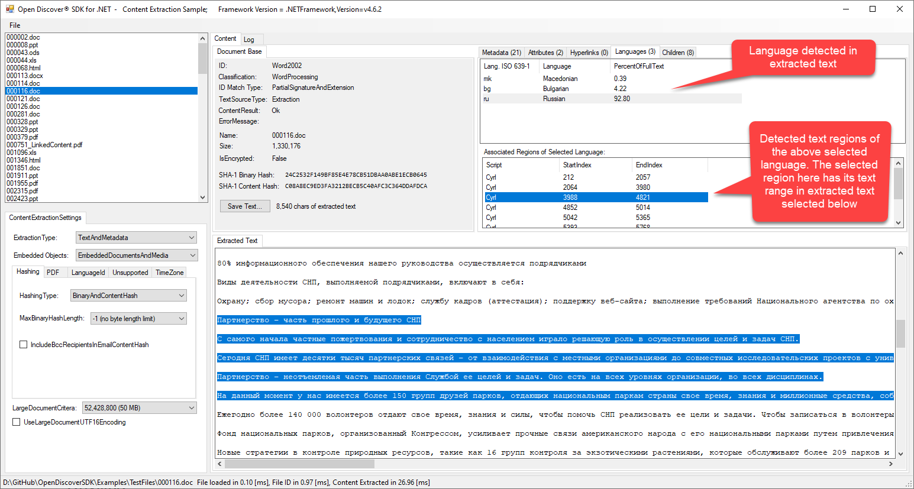

Copyright © 2019-2020 dotFurther Inc. All rights reserved. 

## Document Content Extraction Example

### ContentExtractionExample.csproj:
This WinForm UI example shows how to use the Open Discover SDK API to identify file formats and extract content from various
formats using the OpenDiscoverSDK.ContentExtractorFactory method and its returned interfaces.

### How to use this example:

- Set the Visual Studio Startup Project to "ContentExtractionExample.csproj". 
- Make sure your build Platform is x64 and then menu select Debug/Start Debugging. 
- Once ContentExtraction WinForm UI is dispalyed select menu File/Open and select one of the test files in the "TestFiles" directory of this repository.

Your application should now look something like the image below. There is a panel for document file format identification information, the content extraction result, and document hashes. There is also a panel that contains tab pages for extracted metadata, document attributes, hyperlinks, the languages identified in the extracted text, and all extracted child documents (attachments/embedded objects/embedded media). Notice the bottom right side panel that contains any extracted text. The panels are separated by splitters for easy resizing.

The image below shows the document attributes extracted (see "Attributes" tab page) for the selected document in the file list (left panel list box that shows all files in same directory of the originally opened file). Selecting another file in this list box will extract its content.

The "Hyperlinks" tab page displays any extracted hyperlinks for HTML, office formats, and PDF documents:

The "Languages" tab page displays the languages identified in the extracted text (if any). Some formats such as spreadsheets or any document that is not mostly sentences (e.g., tables, addresses, names, acronyms) can have poor results for language identification. Non-Latin based languages usually yield the best language identification results because of their unique scripts (e.g. CJK). Many languages use the Latin script so this poses more of a challenge:

The "Children" tab displays any information on any extracted attachments/embedded objects/embedded media. Child documents have their file formats identified. To save a child item, right mouse-click on a child item and select "Save As...".

### Note:
To ENABLE long file path support for Windows 10 and .NET 4.6.2, see this article:
 https://blogs.msdn.microsoft.com/jeremykuhne/2016/07/30/net-4-6-2-and-long-paths-on-windows-10/
  
------------------------------------------------------------------------------------------------------------------------
### Note: 
Open Discover SDK is comprised of x64 assemblies due to unmanaged code dependencies
- Build examples with Visual Studio Platform set to x64 (either Debug or Release)
- To edit WinForm forms in VS 2017, set build VS Platform to "Any CPU" and rebuild. This is required to edit WinForm windows. 
  When done, set platform back to x64 before executing in either Debug/Release mode.
------------------------------------------------------------------------------------------------------------------------	
