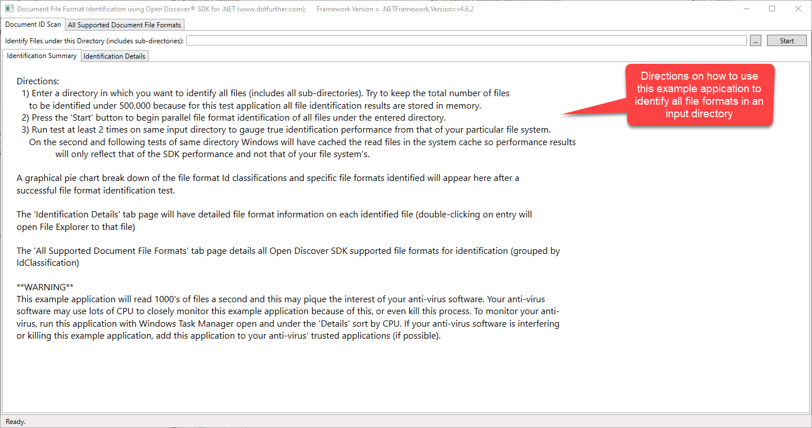
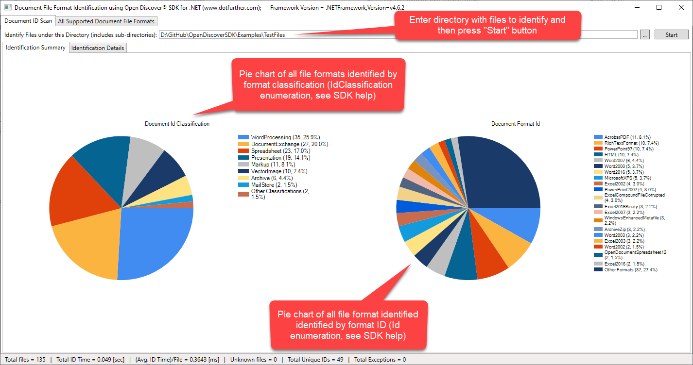
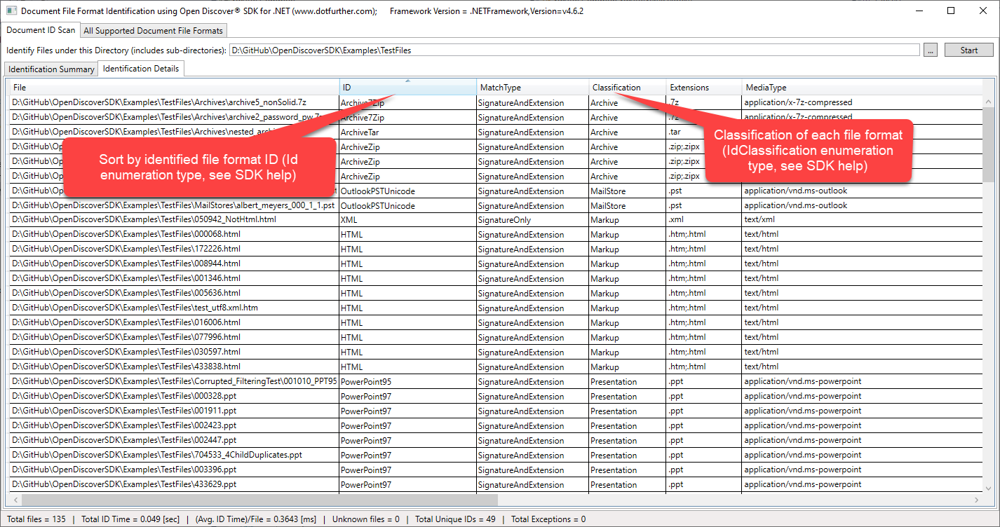
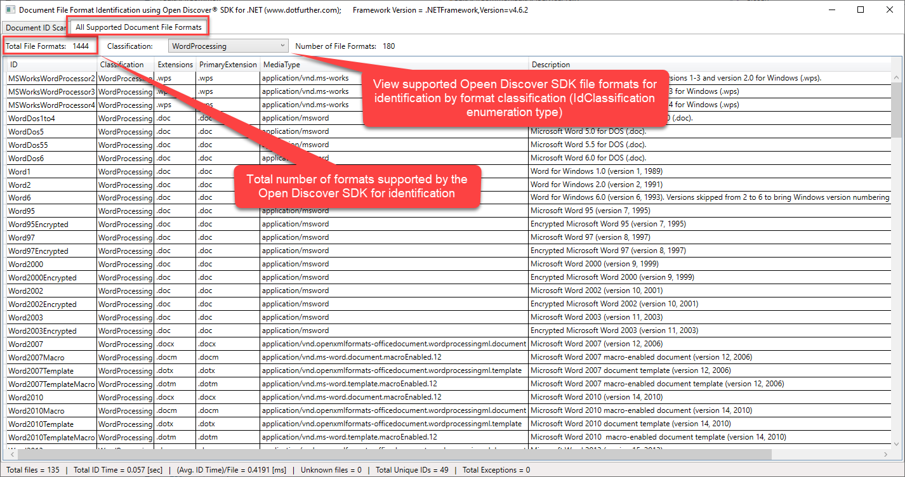

Copyright © 2019-2020 dotFurther Inc. All rights reserved.

## File Format Document Identification Example

### DocumentIdentifierExample.csproj:
This example shows how to use the Open Discover SDK DocumentIdentifier API in a parallel ForEach loop to identify the file formats 
of files contained in a directory (including all sub-directories).

The DocumentIdentifier.Identify methods take either a System.IO.Stream or byte array of file bytes. When opening a stream or reading in all file bytes, it is up to the user to take care of long file paths that are greater than MAX_PATH characters in length.

Any higher level document processing application built upon SDK should make use of file identification at the start of a workflow in order to make decisions on how to best process the document set.

### How to use this example:

Upon DocumentIdentifierExample.exe app startup, the "Directions" screen is shown. Read the app directions: 

Screen shot of a file identication run summary view:

Screen shot a file identification run details view:

Screen shot of "All Supported File Formats" view. This view allows viewing of all Open Discover SDK supported file formats for identification:

To ENABLE long file path support for Windows 10 and .NET 4.6.2, see this article:
 https://blogs.msdn.microsoft.com/jeremykuhne/2016/07/30/net-4-6-2-and-long-paths-on-windows-10/

------------------------------------------------------------------------------------------------------------------------
### Warning: 
Watch your anti-virus software in Windows Task Manager (under Task Manager "Details" sort by CPU). Since this example 
application will identify hundreds to thousands of files a second (opening a FileStream for each file), your anti-virus 
software may monitor it very closely and this monitoring may use a lot of the available CPU. The anti-virus program may even 
kill the process. If this happens you will need to configure your anti-virus to 'trust' this application or any document 
processing application you build with SDK.

------------------------------------------------------------------------------------------------------------------------
### Note: 
Open Discover SDK is comprised of x64 assemblies due to unmanaged code dependencies
- Build examples with Visual Studio Platform set to x64 (either Debug or Release)
- To edit WinForm forms in VS 2017, set build VS Platform to "Any CPU" and rebuild. This is required to edit WinForm windows. 
  When done, set platform back to x64 before executing in either Debug/Release mode.

