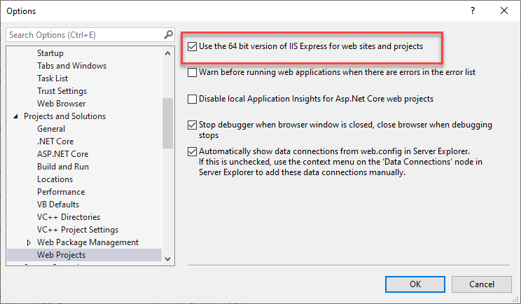
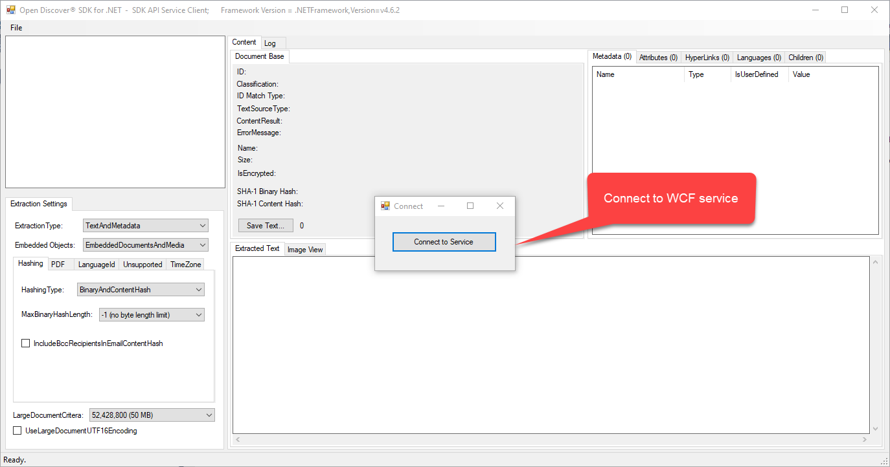
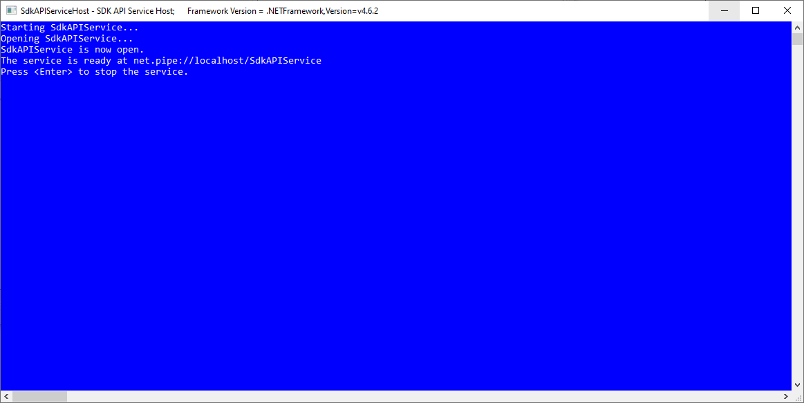
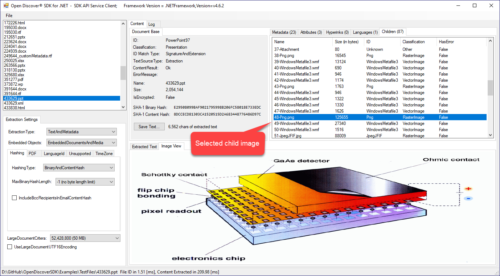
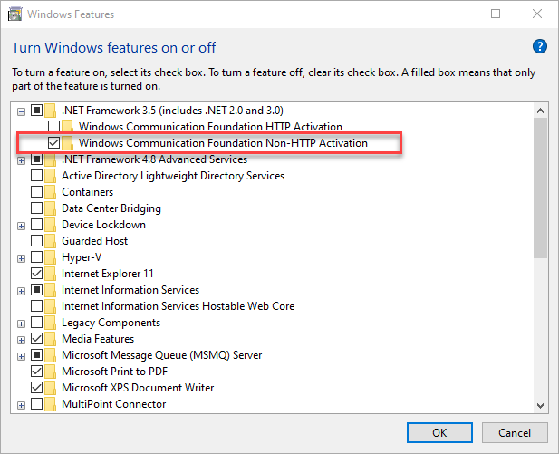
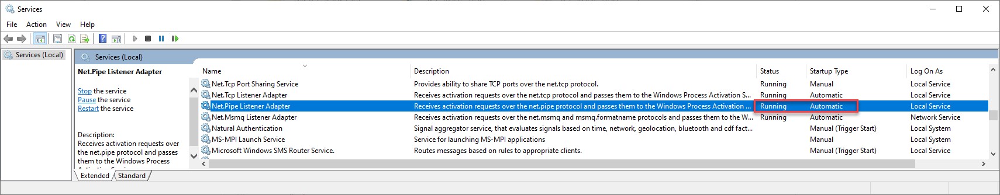

Copyright © 2019-2020 dotFurther Inc. All rights reserved. 

## The SDK example C# projects contained in this directory show case the use of the Open Discover SDK API in a WCF service.

### WCF C# Example Projects:
- **Service Clients\SdkAPIWinFormClient.csproj:** A Winform UI that starts and connects to the console application hosted WCF service 
  and uses that service to extract document content. This test UI will display a dialog to connect to the console app hosted service.
  After connected, use the File menu to open a document that you which to extract content from. The UI will then display the extracted
  content in the various UI controls. The SdkAPIWinFormClient.proj WinForm UI WCF client app is a modified version of the  OpenDiscoverSDK/SdkSamples/ContentExtraction/ContentExtractionExample.csproj project WinForm UI. 
- **Service Host\SdkAPIServiceHost.csproj:**  Hosts the "SdkAPIWCFService" service in a console application
- **SdkAPI.Common.csproj:** Contains the service interfaces and a lightweight and reusable service proxy.    
- **SdkAPIWCFService.csproj:** Contains the service implementation

These example projects demonstrate how SDK extracted document content is supported for serialization and show how to implement document content extraction as an out-of-process service for a layer of main application fault protection.

Make sure all WCF C# example projects are built (Microsoft Visual Studio menu "Build/Rebuild Solution") before running the Winform UI client app - the client app will start the WCF service host console app (SdkAPIServiceHost.exe). Also make sure the Microsoft Visual Studio solution platform is x64.

The WCF service uses a named pipe for transport, if you have issues connecting to the WCF named pipe service see section [Trouble Shooting WCF Named-Pipe Connection Errors](#trouble-shooting-wcf-named-pipe-connection-errors)

### Configuring Microsoft Visual Studio IIS Express when building your own WCF services
If you are creating your own WCF service that uses Open Discover SDK remember that the SDK assemblies are x64 (64 bit and not AnyCPU). To use Microsoft Visual Studio IIS Express to test a x64 service, make sure you configure IIS for x64 (use Microsoft Visual Studio menu "Tools/Options..." to display the dialog below):

### Example Screen Shots

Running the WinForm client SdkAPIWinFormClient.exe will also launch the the WCF console host executable (SdkAPIServiceHost.exe). Press "Connect to Service" button to connect to the console app hosted WCF service:

The console app that hosts the WCF service is automatically started by the client SdkAPIWinFormClient.exe executable:

After connected to service the Winform SdkAPIWinFormClient.exe app works the same way as the OpenDiscoverSDK/SdkSamples/ContentExtraction/ContentExtractionExample.csproj WinForm app. In the screen shot below, we are viewing the extracted content of a PowerPoint 97-2003 (PPT) file that was selected from a list of files in the left side panel list box. To extract content from a file use "File/Open..." menu - all files in the same directory of the selected file will also appear in the file list box:

### Trouble Shooting WCF Named-Pipe Connection Errors
1. Open Control Panel.
2. Select Programs, then "Programs and Features", or if in Classic view, select "Programs and Features".
3. Mouse click on "Turn Windows Features on or off". 
4. Expand the Microsoft.NET Framework 3.0(or 3.5) tree view node and check the "Windows Communication Foundation Non-HTTP Activation" feature. See first image below for reference.
5. Now run Services.msc
6. Make sure "Net.Pipe Listener Adapter" service is running. Start if not running (also set 'Startup type' to automatic). See second image below for reference.

------------------------------------------------------------------------------------------------------------------------
### Note: 
Open Discover SDK is comprised of .NET x64 assemblies due to unmanaged code dependencies

- Run Microsoft Visual Studio C# examples in x64 solution platform (either Debug or Release)
- To edit WinForm forms, set build platform to "Any CPU" and rebuild. This is required to edit WinForm windows as Visual Studio WinForm designer is a 32-bit process. When done, set solution platform back to x64 before executing in either x64 Debug/Release mode.
- If you get run-time initialization exceptions with error messages like "An attempt was made to load a program with
  an incorrect format" then you are mixing x86 and x64 platforms. 

