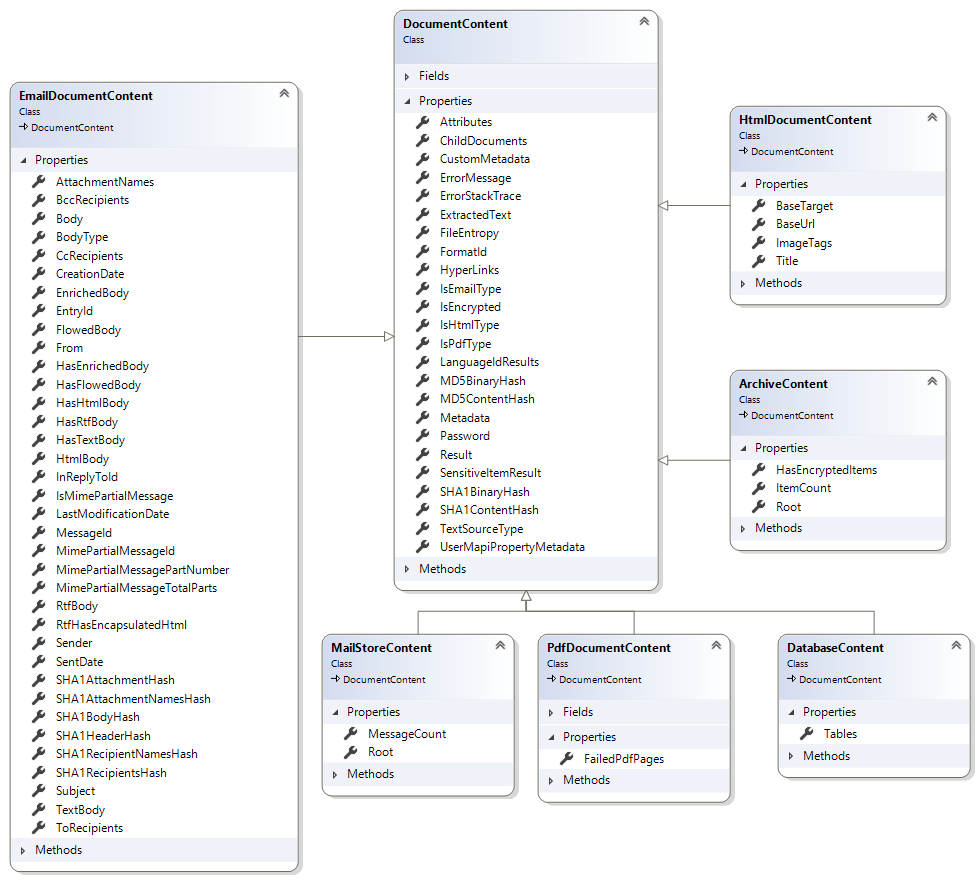
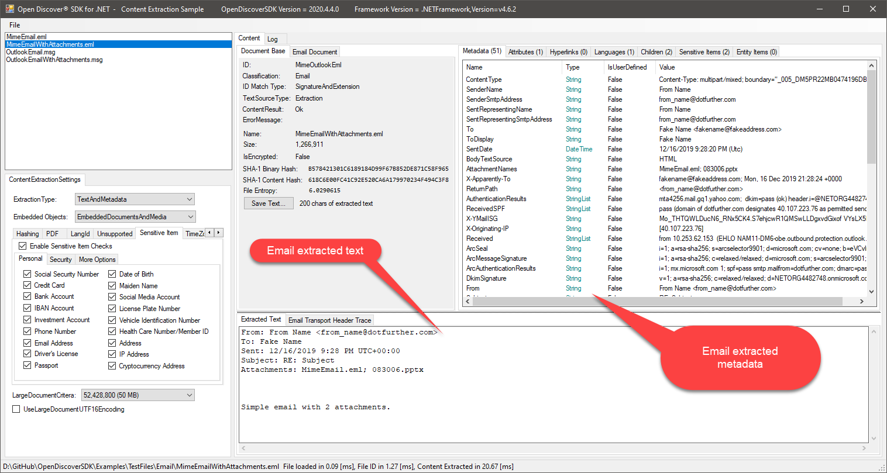
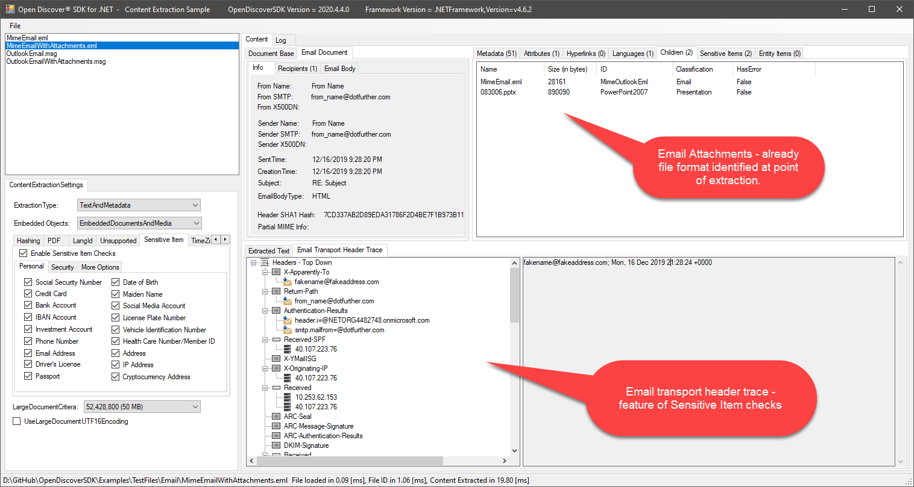

# Features Overview

This section gives a quick overview of the Open Discover® SDK API document file format identification and extracted document content features.

<table>
	<tr>
		<th>
			
				
			</img>  Important
		</th>
	</tr>
	<tr>
		
		<td>
		
The .NET assemblies that comprise the Open Discover SDK for .NET are x64 release builds (not AnyCPU) due to x64 dependencies. Therefore, applications that reference and use the SDK assemblies MUST also be x64 builds.
</td>
	</tr>
</table>

This topic contains the following sections:
<ul><li><a href="#document-file-format-identification">

Document File Format Identification</a></li><li><a href="#extract-document-content:-text,-metadata,-attachments,-and-more...">Extract Document Content: Text, Metadata, Attachments, and more...</a></li><li><a href="#see-also">See Also</a></li></ul>

## Document File Format Identification

Open Discover SDK allows users to reliably identify document file formats using unique internal file signatures of the various supported document formats. Currently, over 1,600 file formats are supported for identification. See <a href="6f1047fb-7367-c09c-5621-ae7632c8404b">Id</a> enumeration for the supported file format identifications.

To identify file formats, developers use the overloaded SDK method <a href="5c18f0cf-0ec5-aff9-10b8-e2c62ac74a73">DocumentIdentifier</a>.Identify. This method returns a <a href="b988a0c1-116e-339f-6db3-dfdf9ab0247a">IdResult</a> object with properties that contain useful information on the identified file format, such as:
<table><tr><td><a href="b4fb5522-8bb4-b6ac-fc42-ac833701e116">ID</a></td>
<td>Contains the identified file format as a <a href="6f1047fb-7367-c09c-5621-ae7632c8404b">Id</a> enumeration value, e.g., Id.OutlookMessage, Id.OutlookMeetingRequestAccept, Id.Excel2007Template, Id.OutlookPSTUnicode, etc.</td>
</tr><tr><td><a href="148c150d-a080-8002-0778-a8c9edb23a33">Classification</a></td>
<td>Contains the classification of the file format as a <a href="1e3a8090-926a-275b-2e9c-c0851d3c49e2">IdClassification</a> enumeration value. This property can be used in full-text search indexes as indexable/searchable fields to help filter search results by document classification, for example, to limit a search to all IdCassification.WordProcessing document formats or to limit a search to all IdCassification.Spreadsheet document formats.</td>
</tr><tr><td><a href="5a160529-709e-5bb6-a874-568a0c84b277">EncodingID</a></td>
<td>For text-based formats this property holds the detected text encoding (specified by an Id enumeration value) of the text based format, e.g., Id.Text7BitASCII, Id.Text_Shift_JIS, Id.Text_Big5, Id.Text_Windows_1250, Id.TextUTF8, etc.</td>
</tr><tr><td><a href="68bb8056-c198-83bf-9af8-1efaa1aaae7a">MatchType</a></td>
<td>Gives information on quality (confidence) of the file format identification.</td>
</tr><tr><td><a href="5d81e6bd-6bc5-0135-f383-ec6c5a38e4a4">MediaType</a></td>
<td>If known, the IANA Media Type (formerly known as MIME Type) of the file format.</td>
</tr><tr><td><a href="59e1b94f-e08c-2c04-d827-0ff8f98ef0b5">Description</a></td>
<td>A string description of the file format.</td>
</tr><tr><td><a href="a42de810-32d0-5d81-0d5c-443d8f213638">Extensions</a></td>
<td>A string of all known file extensions associated with this file format.</td>
</tr><tr><td />
<td>And more, see <a href="b988a0c1-116e-339f-6db3-dfdf9ab0247a">IdResult</a></td>
</tr></table>

To see how to programmatically identify document file formats using the <a href="5c18f0cf-0ec5-aff9-10b8-e2c62ac74a73">DocumentIdentifier</a> class see the <a href="523f1375-389d-4192-be27-f8c8d678afca">Identify Document File Formats</a> help topic.

<table>
	<tr>
		<th>
			
				
			</img>  Note
		</th>
	</tr>
	<tr>
		
		<td>
		
Open Discover SDK file format identification does not rely on file extensions except to judge the quality of identification and to help identify a small number of <a href="6f1047fb-7367-c09c-5621-ae7632c8404b">Id</a>'s that do not have unique enough identifying signatures. One such case would be encrypted Microsoft Office 2007 (and newer) Word, PowerPoint, and Excel documents. In their password encrypted state, these documents have the exact same internal file format (OLE2 compound file format) that has an encrypted OLE stream that contains the original document. Without the file extension (.docx,.pptx,.xlsx) it is impossible to know which specific Office format the document is until after it is decrypted. If the file extension is removed from an encrypted Office 2007 and newer document it will be identified as a generic Id.MicrosoftOfficeEncrypted for this reason.

For the above reasons, it is recommended that the user always populate the <a href="5c18f0cf-0ec5-aff9-10b8-e2c62ac74a73">DocumentIdentifier</a>.Identify 'filePath' argument with the file's full path or file name with extension, if known.
</td>
	</tr>
</table>

## Extract Document Content: Text, Metadata, Attachments, and more...

This section contains the following subsections:
<ul><li><a href="#documentcontent-class">

DocumentContent Class</a></li><li><a href="#emaildocumentcontent-class">EmailDocumentContent Class</a></li><li><a href="#htmldocumentcontent-class">HtmlDocumentContent Class</a></li><li><a href="#archivecontent-class">ArchiveContent Class</a></li><li><a href="#mailstorecontent-class">MailStoreContent Class</a></li><li><a href="#databasecontent-class">DatabaseContent Class</a></li></ul>

Open Discover SDK for .NET allows users to extract various document content from documents using a factory pattern. The sub-sections that follow give a brief description of the types of content extracted for office documents, images, multimedia, emails, PDFs, HTML, archive containers, mail store containers, and database files. In addition to extracting archive and mail store container level metadata, the SDK also supports extracting items from archive (7ZIP, ZIP, RAR, TAR, etc) and mail store (PST, OST, MBOX, etc) containers.

Open Discover SDK can extract over 1,350+ known metadata fields across all supported file formats. See <a href="520b27cc-9ac9-4549-2981-558ed96ae428">OpenDiscoverSDK.Interfaces.Metadata</a> namespace for known metadata fields and helper classes.

The sub-sections that follow briefly describe the types of document content (i.e., "what data can you extract") that are extracted from document formats and not the "how to" in getting the content. To see how to programmatically extract document content and how to extract items from archive and mail store containers using the <a href="2fbf109b-c0df-5cb9-abc9-e22bc3957c16">ContentExtractorFactory</a> class see the "How To" <a href="71d4234a-21a7-48a5-9d83-d1b8a2ed4250">Extract Content using the SDK ContentExtractorFactory</a> help topic.

#### DocumentContent Class
  

The <a href="8e86a5a1-9129-b079-8605-f7fa3f3a1f21">DocumentContent</a> class stores the following extracted document content:
<table><tr><td><a href="72ac3b45-72b3-56b8-7864-53f0d59552f4">ExtractedText</a></td>
<td>Document text (including user comments and optionally revision tracking text)</td>
</tr><tr><td><a href="f6759da6-46fa-d113-da7f-5575ec427ada">Metadata</a></td>
<td>Standard (non-user-defined) document metadata</td>
</tr><tr><td><a href="1e6a8cab-766f-a02f-1818-0fd49be05e6d">CustomMetadata</a></td>
<td>User defined document metadata</td>
</tr><tr><td><a href="a409030e-5938-2734-d344-61d4db1c129b">Attributes</a></td>
<td><a href="97455b46-6bb8-0e3b-270d-5e3bdde3f3ee">DocumentAttributes</a> are used to alert end user of password protected documents, externally linked content, special content, and more...</td>
</tr><tr><td><a href="eada5023-cf5e-1624-1ee2-ef5073c9e448">HyperLinks</a></td>
<td>Hyperlinks extracted from HTML, PDF, and supported office formats</td>
</tr><tr><td><a href="0782bb83-dff4-12bf-fc6e-da7a127bcfb6">ChildDocuments</a></td>
<td>Attachments/Embedded objects and office media</td>
</tr><tr><td><a href="2ec513db-4269-6878-93b6-a58cae60f9f1">MD5BinaryHash</a></td>
<td>SHA-1 binary hash (hash of all document bytes)</td>
</tr><tr><td><a href="a852bcf7-e763-6d05-21d0-198c8c9e1fe3">MD5ContentHash</a></td>
<td>Proprietary content-based MD5 hash for supported email and office document formats</td>
</tr><tr><td><a href="41c5b8b6-1d52-7553-fe0e-048d53901ca2">SHA1BinaryHash</a></td>
<td>SHA-1 binary hash (hash of all document bytes)</td>
</tr><tr><td><a href="66becb90-e903-e12d-cf4d-2a8aa6b65937">SHA1ContentHash</a></td>
<td>Proprietary content-based SHA1 hash for supported email and office document formats</td>
</tr><tr><td><a href="143f6b70-04ce-24cd-21f7-0cc1e5999a41">LanguageIdResults</a></td>
<td>Languages identified in extracted text</td>
</tr><tr><td><a href="19fc01b8-651c-b331-de85-d71891ec7f23">EntityExtractionResult</a></td>
<td>Detection of sensitive items such as social security numbers, credit card numbers, health insurance member IDs, driver's license numbers, social media accounts, and more. See <a href="2caef568-f7bd-69fc-89c4-aa0d3e2c497b">EntityType</a>. In addition to sensitive item information, the SDK will also return information on recognized entities related to person name, banking, hospitals, legal, health care, insurance, and more. See <a href="75bf3100-d4b4-0098-46f5-b953923776a9">Entity</a>.</td>
</tr><tr><td />
<td>And more, see <a href="8e86a5a1-9129-b079-8605-f7fa3f3a1f21">DocumentContent</a> for more information.</td>
</tr></table>

Document hashes, e.g., SHA1BinaryHash and SHA1ContentHash, can be used to identify exact binary (bit-wise) duplicate documents or identify documents with same content (same text and attachments). In addition to SHA-1, MD5 binary and content hashes (see MD5BinaryHash and MD5ContentHash) are calculated because of their legacy in electronic discovery (eDiscovery) industry.

The DocumentContent class stores the extracted content for all document formats except for the following derived special content classes that store additional extracted content:
<ul><li>Emails (see <a href="4ead9d3b-7f35-a7fc-a759-9441e2ab2eb5">EmailDocumentContent</a>)</li><li>PDF documents (see <a href="3bd6de6c-0baa-4567-da66-9d3eb1cf9ea0">PdfDocumentContent</a>)</li><li>HTML documents (see <a href="9e724f95-10b9-9a29-698d-9d88a616d5e0">HtmlDocumentContent</a>)</li><li>Archive/media image containers (7Z, ZIP, RAR, TAR, WIM, etc) (see <a href="e640f8d6-59ed-1039-25c0-f658db539548">ArchiveContent</a>)</li><li>Mail store containers (PST, OST, MBOX, etc) (see <a href="6a4ff84a-cc1e-7749-0ab2-6734b7fd09b8">MailStoreContent</a>)</li><li>Database files (see <a href="0642e321-3e14-a0e4-3bd5-4f74bc3036cb">DatabaseContent</a>)</li></ul>

Each of the above special DocumentContent derived classes are discussed in sections below. A class diagram of the DocumentContent derived classes:
<figure></figure>

#### EmailDocumentContent Class
  

The <a href="4ead9d3b-7f35-a7fc-a759-9441e2ab2eb5">EmailDocumentContent</a> class stores the content from its DocumentContent base class as described above but also has the following additional extracted email specific content:
<ul />

<table><tr><td><a href="502015a6-cbd0-29d8-ea40-eefe5210ce49">AttachmentNames</a></td>
<td>Normalized list of attachment names separated by "; ".</td>
</tr><tr><td><a href="8afb17ec-f9a6-d717-481a-5c5d07a9df7e">BccRecipients</a></td>
<td>"Bcc" recipient email information.</td>
</tr><tr><td><a href="6803637d-85ea-d049-bc85-e610b7cd7318">Body</a></td>
<td>The email text body used for the extracted email text.</td>
</tr><tr><td><a href="7536d38b-becf-d9f0-be75-5fb9ce88a813">BodyType</a></td>
<td>The email body format used for the extracted email text.</td>
</tr><tr><td><a href="a02a7b5e-e0db-1964-0e80-542a1a375afc">CcRecipients</a></td>
<td>"Cc" recipient email information.</td>
</tr><tr><td><a href="056ca651-05c0-b703-ea91-0c7b650e4766">CreationDate</a></td>
<td>Email creation time.</td>
</tr><tr><td><a href="c32cf907-0179-cb3d-676e-e52e80bde0f7">EnrichedBody</a></td>
<td>If property HasFlowedBody is true, then this property contains the Enriched formatted body.</td>
</tr><tr><td><a href="801852b0-b7a6-790e-6dcf-500b4e9aa68b">EntryId</a></td>
<td>Entry ID for Outlook PST/OST extracted message objects in hexadecimal string format.</td>
</tr><tr><td><a href="6710c77c-1fc0-3cda-8724-89845e871ba7">FlowedBody</a></td>
<td>If property HasFlowedBody is true, then this property contains the Flowed formatted body.</td>
</tr><tr><td><a href="25d1f2f6-7328-efe7-08f2-c4e4258cc5ee">From</a></td>
<td>Specifies the author(s) of the message</td>
</tr><tr><td><a href="1dc30d8f-eb9a-13f1-6e94-0e07dd54339a">HasEnrichedBody</a></td>
<td>True if this email has a Enriched formatted body.</td>
</tr><tr><td><a href="866816f0-d32d-c080-9fe7-c19c73011cee">HasFlowedBody</a></td>
<td>True if this email has a Flowed formatted body.</td>
</tr><tr><td><a href="6816e0c2-f2af-0cb9-11c6-44133230954d">HasHtmlBody</a></td>
<td>True if this email has an HTML body.</td>
</tr><tr><td><a href="2ece8697-1fa7-8a16-6261-3ed62d579068">HasRtfBody</a></td>
<td>True if this email has an RTF body.</td>
</tr><tr><td><a href="71a3198c-778a-1380-25b1-1c9c542f5a3c">HasTextBody</a></td>
<td>True if this email has a plain-text body.</td>
</tr><tr><td><a href="94b2ba1d-5193-2d72-2449-eaf17bbb5d53">HtmlBody</a></td>
<td>If HasHtmlBody is true, then this property contains the HTML body.</td>
</tr><tr><td><a href="3276e9fa-e08c-94ab-473d-bd015dc5d6db">InReplyToId</a></td>
<td>MIME 'in-reply-to' header value (if it exists). Contains the value of the original message's MessageId property.</td>
</tr><tr><td><a href="26ddae7e-c5c1-66ee-679f-951ef5ae2cd6">IsMimePartialMessage</a></td>
<td>True if this is an MIME email partial message (ContentType MIME header with MIME-type = "message/partial"); false otherwise.</td>
</tr><tr><td><a href="513f0589-c554-1c04-9b02-eac9557e6176">LastModificationDate</a></td>
<td>Email's last modified time. Check property DateTime.Kind value to determine if UTC, Local, or Unspecified time.</td>
</tr><tr><td><a href="94cad4e5-cf94-9c75-365a-707dd30e2034">MessageId</a></td>
<td>MIME 'message-id' header value (if it exists). This is also set for Outlook .msg files, if it exists.</td>
</tr><tr><td><a href="8cdfad37-dc5f-6815-d5d9-9b6e26f9266a">MimePartialMessageId</a></td>
<td>If IsMimePartialMessage property is true, then property holds the unique partial message 'id'.</td>
</tr><tr><td><a href="04ffc65a-98d4-0f7f-1512-b0c65a7d7aa2">MimePartialMessagePartNumber</a></td>
<td>If IsMimePartialMessage property is true, then property holds the index of this message part (valid range: 1 to MimePartialMessageTotalParts).</td>
</tr><tr><td><a href="07ce0073-e1d5-fe10-a912-c55c16b5bd2e">MimePartialMessageTotalParts</a></td>
<td>If IsMimePartialMessage property is true, then property holds the total number of MIME partial-message parts.</td>
</tr><tr><td><a href="ec597b75-db6f-582a-4191-7ed1c3621b07">RtfBody</a></td>
<td>If HasRtfBody property is true, then this property contains the Rich Text Format (RTF) body.</td>
</tr><tr><td><a href="0810aa76-a051-c537-8559-7a735d768456">RtfHasEncapsulatedHtml</a></td>
<td>If true, the RTF email body (see property RtfBody) has encapsulated HTML (from Microsoft Outlook conversion to RTF); false otherwise.</td>
</tr><tr><td><a href="fe4f0770-92cb-1991-8b1a-0c6d611d3a26">Sender</a></td>
<td>Email sender information. The sender is the <a href="21765f9e-0286-ef3c-c3bd-4e06b00b365a">EmailAddress</a> of the agent responsible for the actual transmission of the message.</td>
</tr><tr><td><a href="e3fe8847-dbb4-ee1b-d4d3-99c58e29f6e6">SentDate</a></td>
<td>Email sent time. Check property DateTime.Kind to determine if UTC, Local, or Unspecified time.</td>
</tr><tr><td><a href="391a4488-1a6e-6b5f-330f-25cd9b89cae6">SHA1AttachmentHash</a></td>
<td>SHA-1 hash of the concatenated SHA1 hash of each attachment binary data (includes hashes of inline images).</td>
</tr><tr><td><a href="338cd696-27e0-d5ad-7da6-7ab371e7cbb2">SHA1BodyHash</a></td>
<td>SHA-1 hash of the email Body property text (converted to lower case and with all white space removed).</td>
</tr><tr><td><a href="422f8301-f310-9f7a-c6cc-3b97193ab8c9">SHA1HeaderHash</a></td>
<td>SHA-1 hash of concatenated message SentDate property date (e.g., Microsoft Outlook (.msg)'ClientSubmitTime' or MIME 'Date' field), subject, Sender property name and email address (converted to all lower case and all white space removed before hashing).</td>
</tr><tr><td><a href="28c883a1-7252-c8de-bb2d-f81f93d0f348">SHA1RecipientNamesHash</a></td>
<td>SHA-1 hash of all recipient names concatenated together (all lower case).</td>
</tr><tr><td><a href="f6294b3d-6cb1-6afe-c1c5-4e4d2058f177">SHA1RecipientsHash</a></td>
<td>SHA-1 hash of all recipient names and email addresses concatenated together (all lower case).</td>
</tr><tr><td><a href="e8ba9988-a7c5-2b53-17bb-b937401b848f">Subject</a></td>
<td>Email subject text.</td>
</tr><tr><td><a href="effd1f38-576f-6f38-7eab-abe57b27b14b">TextBody</a></td>
<td>If HasTextBody property is true, then this property contains the plain-text body.</td>
</tr><tr><td><a href="a5af55d2-1f1e-47ec-8ff7-870aa9cbc066">ToRecipients</a></td>
<td>"To" recipient email information.</td>
</tr></table>

In addition to the above properties, the base class DocumentContent.Metadata dictionary property contains many useful email specific metadata fields extracted from email objects. The best way to get a feel for all the content extracted from supported email formats is to run the following Github SDK content extraction example C# application on email formats: <a href="https://github.com/dotfurther/OpenDiscoverSDK/tree/master/SdkExamples/ContentExtraction" target="_blank" rel="noopener noreferrer">Open Discover® SDK ContentExtraction Example</a>

Example screen shots of the Open Discover® SDK ContentExtraction Example application that displays the extracted content of one of the test emails in the Github repository's "TestFiles\Email" folder: <figure></figure><figure></figure>

The MD5ContentHash and SHA1ContentHash are especially useful for finding duplicate emails in a document set that were saved in the same or different email client formats.

#### HtmlDocumentContent Class
  

The <a href="9e724f95-10b9-9a29-698d-9d88a616d5e0">HtmlDocumentContent</a> class stores the content from its DocumentContent base class as described above but also has the following additional extracted HTML specific content:
<table><tr><td><a href="a25d6e6e-f3b0-240c-368b-f553e4f58ed3">BaseTarget</a></td>
<td>The HTML "base" element tag specifies the base URL/target for all relative URLs in a HTML document.</td>
</tr><tr><td><a href="679bf398-3b97-ede8-8d82-b39428ae8102">BaseUrl</a></td>
<td>The HTML "base" element tag specifies the base URL/target for all relative URLs in a HTML document.</td>
</tr><tr><td><a href="0a35d5cd-5f96-a3e7-f000-6d63e2d495de">ImageTags</a></td>
<td>HTML 'img' tag information.</td>
</tr><tr><td><a href="992850d0-d8b2-947c-6633-180cd777b0f0">Title</a></td>
<td>The HTML "title" element text. This value is null if not defined in document.</td>
</tr></table>

Any HTML hyperlinks extracted are stored in the inherited base class <a href="eada5023-cf5e-1624-1ee2-ef5073c9e448">HyperLinks</a> property.

#### ArchiveContent Class
  

The <a href="e640f8d6-59ed-1039-25c0-f658db539548">ArchiveContent</a> class stores the following extracted archive/media image content:
<table><tr><td><a href="34e2af3a-442f-b9c0-ce93-5379f9197c6f">HasEncryptedItems</a></td>
<td>True if any archive items are password protected (encrypted).</td>
</tr><tr><td><a href="4d9a2de2-182a-f736-cce3-346a04c2ee83">ItemCount</a></td>
<td>The total archive item count. This count includes only file items and not any directory items.</td>
</tr><tr><td><a href="e83e3116-7574-5c06-f883-2c642a26e00b">Root</a></td>
<td>Archive internal directory (folders) structure (if it exists). The root <a href="ad548c58-a9d6-7447-8969-33a7fa5a790a">ContainerFolder</a> is the root directory folder which all sub-directory folders are listed.</td>
</tr></table>

The ArchiveContent.Root property contains the archive's internal directory hierarchy, if the specific archive format supports directories and if internal directories exists.

Information on archive items is stored in the inherited base class property <a href="0782bb83-dff4-12bf-fc6e-da7a127bcfb6">ChildDocuments</a>; however, unlike office documents, emails, and other regular documents, the ChildDocument objects that correspond to the archive items do not have their FormatId property set nor their DocumentBytes property because at this point they have yet to be extracted. Note, the user has to programmatically extract each child item in order to get at the item data (file bytes).

How to extract an archive container's items is discussed in the "How To" section. The best way to get a feel for all the content extracted from supported archive/media image formats is to run the following Github SDK content extraction example C# application on archive formats: Open Discover® SDK ContentExtraction Example <a href="https://github.com/dotfurther/OpenDiscoverSDK/tree/master/SdkExamples/ContentExtraction" target="_blank" rel="noopener noreferrer">Open Discover® SDK ContentExtraction Example</a>

#### MailStoreContent Class
  

The <a href="6a4ff84a-cc1e-7749-0ab2-6734b7fd09b8">MailStoreContent</a> class stores the following extracted archive content:
<table><tr><td><a href="baf998e7-65ab-1b6c-b322-af664404cfe7">MessageCount</a></td>
<td />
</tr><tr><td><a href="e83e3116-7574-5c06-f883-2c642a26e00b">Root</a></td>
<td>Mailstore root folder (only defined for mail containers that have internal folder structures. Not set for MBOX mail stores). The root <a href="ad548c58-a9d6-7447-8969-33a7fa5a790a">ContainerFolder</a> is the root directory folder which all sub-directory folders are listed (if they exist in mail store container).</td>
</tr></table>

The MailStoreContent.Root property contains the mail store container's internal directory hierarchy, if the specific mail store format supports directories and if internal directories exists.

How to extract a mail store container's email objects is discussed in the "How To" section. The best way to get a feel for all the content extracted from supported mail store formats is to run the following Github SDK content extraction example C# application on archive formats: Open Discover® SDK ContentExtraction Example <a href="https://github.com/dotfurther/OpenDiscoverSDK/tree/master/SdkExamples/ContentExtraction" target="_blank" rel="noopener noreferrer">Open Discover® SDK ContentExtraction Example</a>

#### DatabaseContent Class
  

The <a href="0642e321-3e14-a0e4-3bd5-4f74bc3036cb">DatabaseContent</a> class stores the following extracted archive content:
<table><tr><td><a href="c59a9488-c5b5-c9ba-7430-f14238a5827d">Tables</a></td>
<td>Database table and corresponding table column metadata.</td>
</tr></table>

How to extract a database's table text and any binary table column objects is discussed in the "How To" section.

## See Also

#### Reference
<a href="5c18f0cf-0ec5-aff9-10b8-e2c62ac74a73">DocumentIdentifier</a>  
<a href="2fbf109b-c0df-5cb9-abc9-e22bc3957c16">ContentExtractorFactory</a>  

#### Concepts
<a href="7e782821-dd62-4262-b342-f603ac374bba">Supported File Formats</a>  
<a href="59ed8473-fbd9-4bf1-9e80-33226882e71f">How To</a>  

#### Other Resources
<a href="https://github.com/dotfurther/OpenDiscoverSDK" target="_blank" rel="noopener noreferrer">Open Discover® SDK for .NET Samples Repository on GitHub</a>  
