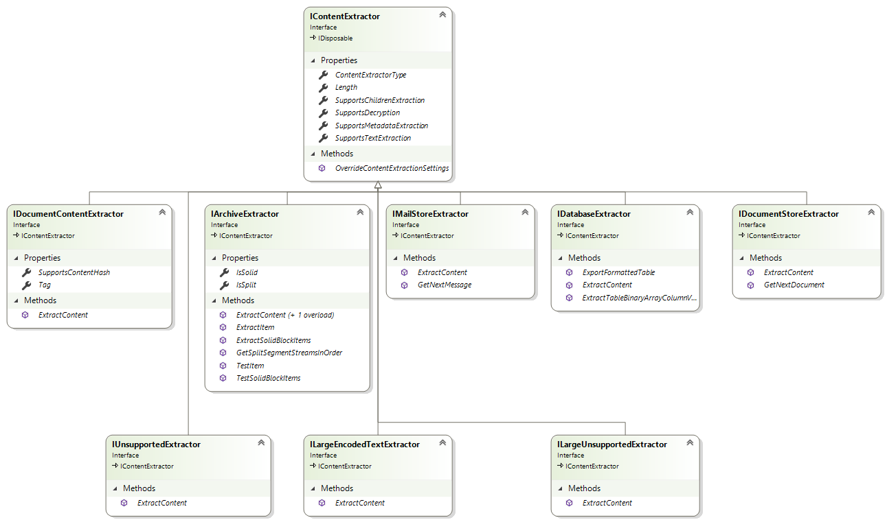

# Extract Content using the SDK ContentExtractorFactory

This topic and sub-topics show how to use the Open Discover SDK content extractor factory pattern to extract content from documents and items from archives and mail store containers.


<table>
	<tr>
		<th>
			
				
			</img>  Important
		</th>
	</tr>
	<tr>
		
		<td>
		<p>The .NET assemblies that make up Open Discover SDK are x64 release builds (not AnyCPU) due to x64 dependencies. Therefore, applications that reference and use the SDK assemblies MUST also be x64 builds.</p></td>
	</tr>
</table>


The steps to extract document content or to extract items from archive or mail store containers:
<ol><li>Identify the document's file format using one of the overloaded <a href="5c18f0cf-0ec5-aff9-10b8-e2c62ac74a73">DocumentIdentifier</a>.Identify methods.</li><li>Use method <a href="2fbf109b-c0df-5cb9-abc9-e22bc3957c16">ContentExtractorFactory</a>.GetContentExtractor to get an <a href="099ca015-0381-74ac-fed4-082901e8f959">ContentExtractorResult</a> object for the specific file format identified in step (1) above.</li><li>Use the <a href="e34c8f80-a415-2275-2f2e-74e78119de93">ContentExtractor</a> property of the returned ContentExtractorResult object in step (2) above to get the base <a href="94fa03c2-ad71-ecdc-48b0-48fb7ff40e45">IContentExtractor</a> extractor interface.</li><li>Use the IContentExtractor object's <a href="7e5a4e4e-e9b6-73cc-6a6a-55a3c97ed0f7">ContentExtractorType</a> property to determine the type of the IContentExtractor derived interface that is specific to extracting content for the file format.</li><li>Type-cast the base IContentExtractor interface to the specific derived IContentExtractor interface and use that interface to extract the desired content.</li></ol>


<table>
	<tr>
		<th>
			
				
			</img>  Note
		</th>
	</tr>
	<tr>
		
		<td>
		<p>Method <a href="2fbf109b-c0df-5cb9-abc9-e22bc3957c16">ContentExtractorFactory</a>.GetContentExtractor takes a <a href="b65f5ca9-d476-8b01-b6d2-c47f988ba0a2">ContentExtractionSettings</a> object as an argument. The ContentExtractorSettings class determines what content is extracted, determines whether hashes are calculated, if extracted text has languages in text identified, and more.</p></td>
	</tr>
</table>


The following are all of the IContentExtractor derived interfaces:
<ul><li><a href="fc555ced-4e25-4a75-d7eb-c52c1ad0fd37">IDocumentContentExtractor</a> - returned for supported non-container documents such as office documents, emails, PDFs, HTML, XML, multimedia, raster images, vector images, etc.</li><li><a href="9d2fb8da-9eff-b1d9-e027-a4b2d24993e8">IArchiveExtractor</a> - returned for supported archive container types such as 7ZIP, ZIP, RAR, TAR, GZIP, etc.</li><li><a href="b6b002d9-7dfa-acce-2221-db203d4ffcfa">IMailStoreExtractor</a> - returned for supported mail store container types such as PST, OST, MBOX, etc.</li><li><a href="72878ee2-8469-dfe5-15b3-d1f3c9fb8ed8">IDatabaseExtractor</a> - returned for supported database file types, currently only Microsoft Access database is supported by this interface.</li><li><a href="075a32e0-700d-6ca2-6d30-a16994b8b27a">IDocumentStoreExtractor</a> - returned for supported document store container types, currently only Domino DXL document database export file (an XML database of documents) is supported by this interface.</li><li><a href="425bbcf3-95b6-7564-9777-41f0c39bb9b7">IUnsupportedExtractor</a> - returned for unsupported document formats if <a href="d2e304cb-8803-14fc-d7a8-09c27365c6a0">UnsupportedFiltering</a> is true. This interface allows for binary-to-text filtering on unsupported formats.</li><li><a href="15fe76f2-d9da-2d1d-0fde-5751a490457f">ILargeUnsupportedExtractor</a> - returned for "large" unsupported document formats. "Large" is defined by property <a href="90aee97f-a132-9d0b-5c91-d6ac2eb95ace">LargeDocumentCritera</a>. This interface allows for binary-text filtering of very large files but writes the filtered text (which can be very large) to a System.IO.FileStream object instead setting the <a href="72ac3b45-72b3-56b8-7864-53f0d59552f4">ExtractedText</a> property (in-memory string) with extracted text. See also <a href="d2e304cb-8803-14fc-d7a8-09c27365c6a0">UnsupportedFiltering</a>.</li><li><a href="12e90c5d-c0eb-b570-10bb-3626709715dd">ILargeEncodedTextExtractor</a> - returned for "large" encoded text documents (e.g., large CSV formatted files). "Large" is defined by property <a href="90aee97f-a132-9d0b-5c91-d6ac2eb95ace">LargeDocumentCritera</a>. This interface is only useful if encoded text file is not in an easily indexed encoding like UTF-8 or UTF-16. The extracted text, which is written to a System.IO.FileStream object instead of setting the <a href="72ac3b45-72b3-56b8-7864-53f0d59552f4">ExtractedText</a> property (in-memory string), is automatically written in UTF-8 or UTF-16 encodings. See property <a href="e703d60d-4cc3-b9ae-58df-0a913e95be3e">UseLargeDocumentUTF16Encoding</a>.</li></ul>


Diagram of the IContentExtractor derived interfaces:
<figure></figure>


The following example shows the pattern of how to get the specific IContentExtractor derived interfaces. How to use the specific derived interfaces is discussed in this section's sub-topics.


**Document Content Extraction Pattern**  
``` C#
var settings = new ContentExtractionSettings();
settings.CalculateBinaryHash        = true; // Calculate binary hashes
settings.CalculateContentHash       = true; // Calculate content hashes on supported formats such as emails and Office documents
settings.ExtractEmbeddedDocuments   = true; // Extract attachments\embedded documents
settings.ExtractOfficeEmbeddedMedia = true; // Extract embedded media for Office formats
settings.ExtractionType             = ContentExtractionType.TextAndMetadata; // We want text and metadata extracted

using (var stream = File.OpenRead(filePath))
{
    //========================================================================================
    // Step 1 - Identify document file format:
    //========================================================================================
    var docIdResult = DocumentIdentifier.Identify(stream, filePath);

    //========================================================================================
    // Step 2 - Get the content extractor result for the file format:
    //========================================================================================
    var contentExtractorResult = ContentExtractorFactory.GetContentExtractor(stream, docIdResult, filePath, settings);

    if (contentExtractorResult.HasError)
    {
        LogErrorMessage(string.Format("Error getting content extractor for file ID {0}: {1}", docIdResult.ID, contentExtractorResult.Error));
    }
    else
    {
        //========================================================================================
        // Step 3 - Get the specific IContentExtractor derived interface for the file format:
        //========================================================================================
        var extractorType = contentExtractorResult.ContentExtractor.ContentExtractorType;

        switch (extractorType)
        {
            case ContentExtractorType.Archive:
                {
                    var archiveExtractor = (IArchiveExtractor)contentExtractorResult.ContentExtractor;
                    // TODO: Following help topics will show how to use this interface
                }
                break;
            case ContentExtractorType.Document:
                {
                    var docExtractor = ((IDocumentContentExtractor)contentExtractorResult.ContentExtractor);
                    // TODO: Following help topics will show how to use this interface
                }
                break;
            case ContentExtractorType.MailStore:
                {
                    var mailStoreExtractor = ((IMailStoreExtractor)contentExtractorResult.ContentExtractor);
                    // TODO: Following help topics will show how to use this interface
                }
                break;
            case ContentExtractorType.Database:
                {
                    var databaseExtractor = ((IDatabaseExtractor)contentExtractorResult.ContentExtractor);
                    // TODO: Following help topics will show how to use this interface
                }
                break;                            
            case ContentExtractorType.DocumentStore:
                {
                    var docStoreExtractor = ((IDocumentStoreExtractor)contentExtractorResult.ContentExtractor);
                    // TODO: Following help topics will show how to use this interface
                }
                break;
            case ContentExtractorType.Unsupported:
                {
                    // Binary-to-text extraction: Note, if property ContentExtractionSettings.BinaryToTextOnUnsupportedTypes is false, then calling
                    //                            IUnsupportedExtractor.ExtractContent will only calculate binary hashes without performing binary-to-text filtering.
                    //                            Binary-to-text is not useful for file formats (e.g., Id.MPEG1ElementaryStream) that do not have any textual
                    //                            content. It is up to the user to filter these formats out using either file format Id or file format classification.
                    var bin2TextExtractor = ((IUnsupportedExtractor)contentExtractorResult.ContentExtractor);
                    // TODO: Following help topics will show how to use this interface
                }
                break;
            case ContentExtractorType.LargeUnsupported:
                {
                    // Binary-to-text extraction - we extract to a memory stream here but user should extract to a file stream for the cases
                    //                             of very 'large' binary documents - because the filtered text could get into the gigabytes
                    //                             depending on the BLOB size and content.
                    var largeDocBin2TextExtractor = ((ILargeUnsupportedExtractor)contentExtractorResult.ContentExtractor);
                    // TODO: Following help topics will show how to use this interface
                }
                break;
            case ContentExtractorType.LargeEncodedText:
                {
                    // "large" encoded text file extraction 
                    var largeEncodedTextExtractor = ((ILargeEncodedTextExtractor)contentExtractorResult.ContentExtractor);
                    // TODO: Following help topics will show how to use this interface
                }
                break;
        }
    }
}
```


## See Also


#### Concepts
<a href="8e0c8470-7ad9-4dae-95fb-7a9eb05b78f1">How to use the IDocumentContentExtractor Interface</a>  
<a href="065d43df-6ccd-4692-a2b2-0f114a52848b">How to use the IArchiveExtractor Interface</a>  
<a href="91048e30-0b6e-476f-986d-f5f56b7a5525">How to use the IDatabaseExtractor Interface</a>  
<a href="6d85e229-353b-4ec3-8ede-5710273d1cf5">How to use the IMailStoreExtractor Interface</a>  
<a href="a2cbea0a-2486-40fb-8c08-2db0b8f5ee27">How to use the IDocumentStoreExtractor Interface</a>  
<a href="e0906c8e-d500-4c1f-af0c-7ea7e407b53e">How to use the IUnsupportedExtractor Interface</a>  
<a href="113aee0b-e0dd-4667-91de-3f82c0c96636">How to use the ILargeUnsupportedExtractor Interface</a>  
<a href="b789bdbc-1f4a-4642-93da-86e218036e8f">How to use the ILargeEncodedTextExtractor Interface</a>  


#### Other Resources
<a href="https://github.com/dotfurther/OpenDiscoverSDK" target="_blank" rel="noopener noreferrer">OpenDiscoverSDK Samples Repository on GitHub</a>  
